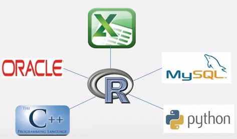
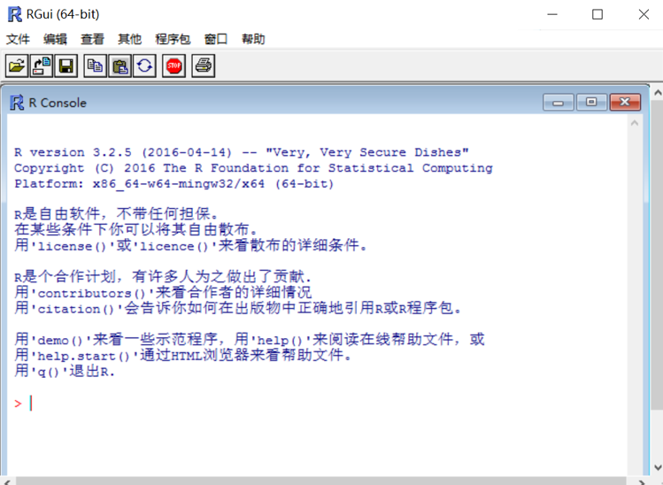
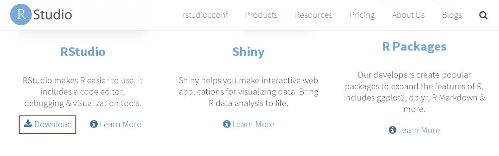
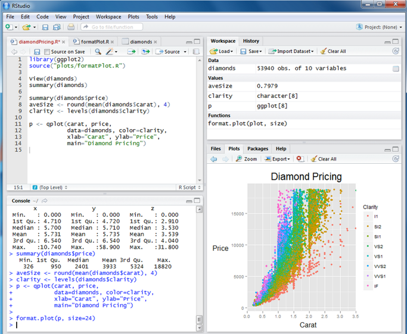
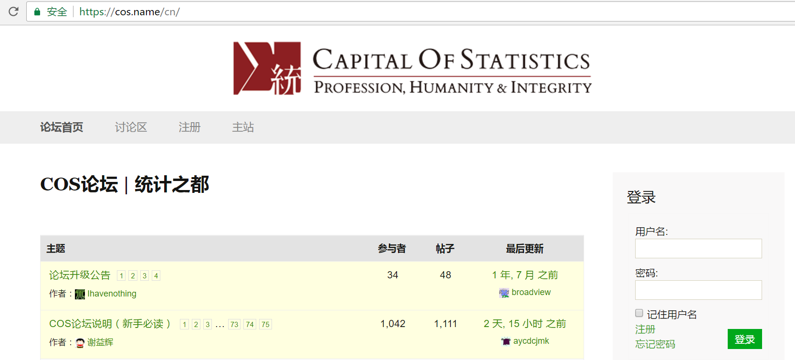
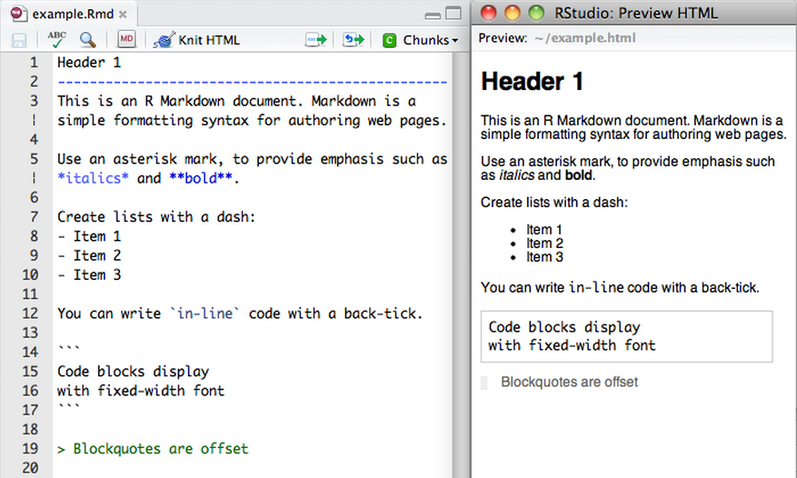
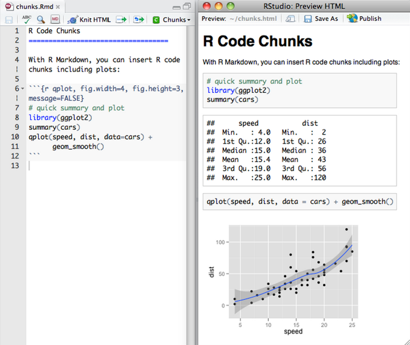
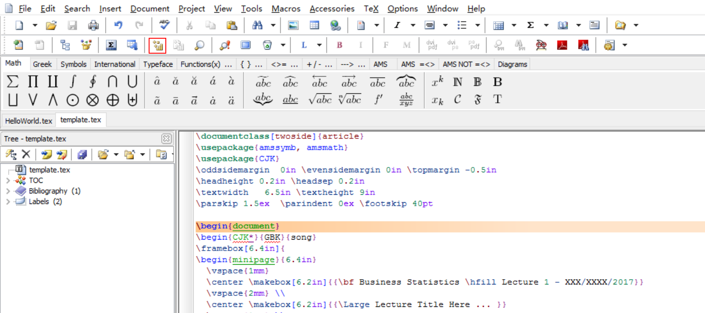
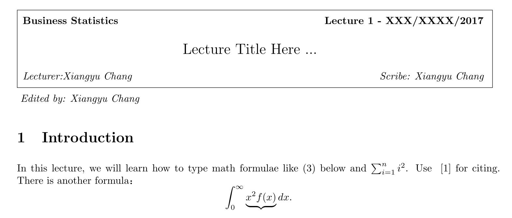

```{r setup, include=FALSE}
knitr::opts_chunk$set(echo = TRUE)
```

# **浅谈R语言**

## 一言不合就开


# R

## Why
我们为什么要使用R语言，它有哪些出色的特征让大家爱不释手呢？   
    
- 免费 (开源)  
- 强大的作图功能    
- 强大的统计工具  
- 易于生成可复写的报告   
  
- 易于与其他工具集成    
    > 作为一款软件系统，它有极方便的扩展性。你的数据原来存在Oracle 里？没问题，轻松导入；你的数据在MySQL 里？没问题， 照样解决。文本文件、数据库管理系统，统计软件,专门的数据仓库都可兼容。它同样可以将数据输出并写入到这些系统中。
同时它还可以轻松于各种语言完成互调，比如你曾经爱的python，还有C，都可无缝对接。  


## What

R是如何发展起来的呢？  
那就得先从另一款语言S谈起，（嗨不是你们脑海里的大S，小S啦！）

  

S语言是由 AT&T贝尔实验室John Chambers等人开发的一种用来统计编程的语言。S语言目前有两种实现版本，一种是现在由TIBCO经营的商业软件 S-plus, 另一种就是免费开源的R语言。

1992年，Auckland大学的Robert Gentleman 和 Ross Ihaka 为了能够更有效地开展大学里的统计入门课程的教学，他俩决定引入S语言来开发一套软件，1994年该软件最初版本基本成型。这就是后来我们用到的R的雏形啦。    


### Features
- **Statistical computing**   
  > 作为统计分析工具，它几乎覆盖整个统计领域的前沿算法。
从火到根本停不下来的的神经网络（就是那只下围棋的机器狗脑袋里的东西），到经典了一百多年还熠熠生辉的基础回归，数千个R包，上万种算法，你都能找到可直接调用的函数实现。  
  

  
- **Graphics**  
  > 可以说，点图线图柱状图直方图，R语言样样精通，而且设计感满满，绝对可以在这个看脸的世界里独挡一面。比如你可以画这样的图：  
  

- R还有什么神奇的技能（八卦篇）  
  下面我们再来八一八那些年那些牛人是怎么玩坏R的！  
  
  > <a href='https://cos.name/2015/09/hadley-wickham-the-man-who-revolutionized-r/'>每天都被自己帅醒？你可以用程序自己画肖像</a>；  
      
  > <a href='http://blog.fens.me/r-game-2048/'>手机小游戏玩的不过瘾？自己写程序开发游戏</a>  
      

  > <a href='https://cos.name/2015/02/lucky-money/'>抢红包为何手气最佳的总不是你？写个程序看看分红包算法如何拉大你和他的贫富差距？</a>  
      
      
      

## How
如何获取R呢？

点击以下链接即可下载 R: 

https://www.r-project.org/

  

以下为R的界面示意图：  

  

希望你的内心OS别是：天啦噜，好丑！别看它丑，但是它统计、计算样样精通。  

不过，在这个颜值可以统领世界的年代，我们将为大家介绍一款更加美观的编辑器——RStudio.

# RStudio

- R的IDE (Integrated Development Environment)
- 下载 RStudio: http://www.rstudio.com/




## RStudio界面
RStudio 有四个主窗口:

- Source(左上)  
- Console(坐下)  
- Workspace/History(右上)  
- Files/Plots/Packages/Help(右下)  



## Key Concepts
R在安装的时候会自带一系列默认包（包括base, datasets, stats,methods, graphics等包）, 它们提供了很多丰富功能的函数与数据，大家可以自行调出玩耍，命令search() 可以告诉你工作空间里已有哪些包可被直接使用。当然，如果你需要装备更多更厉害的拓展技能，就需要安装新包来实现啦！

- Packages  
Collections of R functions, data, and compiled code in a well-defined format
- Library  
The directory where packages are stored


### Packages
- Installing a package  
`install.packages("PackageName")`
- Loading a package   
`library("PackageName")`
- Knowing a package  
`?PackageName` or `?FunctionName`

### Resources
俗语有云，人在江湖，有时候学富几车都不够。现在，我们给大家亮出江湖终极生存指南：自学的途径，告诉大家如何自我拓展，让你给点阳光就灿烂！（其实就是十脸懵圈时该如何自救！）  

- COS中文论坛: https://cos.name/cn/



# R Markdown
下面再为大家介绍一款使功力蹭蹭长十年的利器——R Markdown.
- R Markdown 可以在报告中整合入R代码

- 当数据或代码变化时,报告也随之改变

- 不必再去复制粘贴图表和数字

- 创建 __可复写的__ 报告
  - 任何人,只要他/她有你的R Markdown (.Rmd) 文件和需要输入的数据,就可以复现你的分析,并得到相同的结果 (表格, 图像, 数据概要)
  
- 可以以不同的格式输出报告,如HTML (默认), Microsoft Word, 或 PDF

## R Markdown示例
- 以下示例展示了在RStudio中的Source 面板打开的一个 **R Markdown** (.Rmd) 文件.  
- 点击Source 面板上的 **Knit HTML**按钮,可以由Rmd 文件生成报告.
- 结果会展示在右侧的 **预览窗口**
- 你可以直接生成html (默认), MS Word, 和pdf 格式的文档
- 讲义中的这些幻灯片也是在RStudio (R Presentation)中创建的

  

- 你需要R的代码块,以此来在你的报告中整合入R的输出结果
- 当你Knit的时候,所有出现在"三个反勾号"中的代码都会被执行

  

## R Markdown练习: Hello world!

1. 在你的电脑上打开 **RStudio**
2. File > New File > R Markdown ...
3. 将第一行的代码 `summary(cars)` 改写为 `print("Hello world!")`
4. 点击 `Knit HTML` 来生成一个HTML文件
5. 将Rmd文件保存为 `helloworld.Rmd`  
  > 你的所有家庭作业和大部分的实验都将以独立Rmd文件的形式来提交,并且这个Rmd文件需要你的编辑以包含作业的答案

## 实用小技巧

按键 | 描述
----------|-------------
`<tab>` | 自动补全命令和文件名,列出函数的参数,非常实用
`<up>` | 在控制台提示框循环浏览历史命令
`<ctrl-up>` | 列出与当前命令相匹配的历史命令
`<ctrl-enter>` | 将Source窗口中的当前行粘贴至控制台,非常利于试验想法
`<ESC>` | 终止当前为完成的命令,退出 + 命令提示框  

# LaTeX
- Pronunciation: «Lah-tech» or «Lay-tech» 
- A document preparation system for high-quality typesetting
- Download  
For Windows: http://www.ctex.org/CTeXDownload  
For Mac OS: https://www.tug.org/mactex/


    


下图为运行结果的部分截图：  

  

   

***

 

